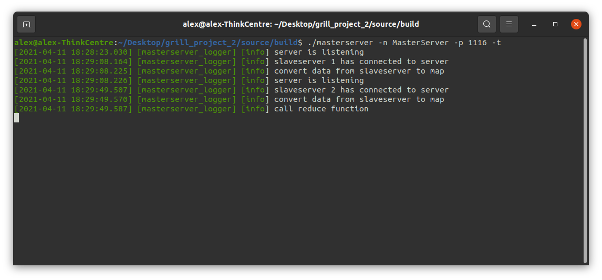

# MapReduce-System
<div align="center">
    <br />
    
</div>

[](https://www.boost.org/LICENSE_1_0.txt)

## Grill Alexander NVS Projekt 2021
Die Lage in Österreich bezgl. COVID-19 ist auch im Jahr 2021, im zweiten Schulsemster ernst. Ein Lockdown nach dem anderem, Festlegungen von Maßnahmen und Ausgangsbeschränkungen,
die Anzahl der aktiven Fälle steigt, daher muss die Bundesregierung mit solchen stengen Maßnahmen agieren, um die Bevölerunge zu schützen.
So wurden Schulerunterrichtstunden bis Ende Jänner online gehaltet, anschließend erfolgte Schichbetrieb in den Schulen.
Foglendessen hat Herr Professor Kolousek beschlossen, dass die Schüler auch im 2.Semester ein NVS Projekt erarbeiten müssen, weil es zu aufwändig wäre, eine "Praktische Arbeit" und Theorietest zu machen. Diese Repo umfasst die Umsetzung des Projekts, als auch die dazugehörige Dokumentation und nötigen Grundlagen.

Das Projekt deckt folgende Themen ab: Grundlagen und Basiskonzepte, Nachrichtenübertragung, Netzarchitektur, Internetprotokoll, Transportprotokolle, Prozesse und Threads, Synchronisation und parallele Programmierung, Kommunikation, Serverprogrammierung, verteilte Systeme, TCP/IP Programmierung wie im Beispiel umgesetzt

### MapReduce-System
In diesem Projekt geht es darum, ein einfaches MapReduce‐System samt Beispielanwendung inkl. Aufarbeitung des Themas zu erstellen. Dabei sollen Daten die in unstrukturierter
Form abgespeichert sind, zusammengefasst und geordnet werden, sodass diese dann daraufhin für weitere Verarbeitungen und Analysen der Daten durchgeführt werden kann. Die Daten werden am Beginn aufgesplittet und in Arbeitspackete aufgeteilt. Diese werden folgedessen, von parallel laufenden Prozesse verarbeitet und das Ergebnis einen weiteren Knoten 
zugesendet. Dies erfolgt so lange bis alle Daten, die am Beginn auf mehreren Knoten aufgeteilt wurden, am Master Server zusammengefasst abgespeichert werden können.

### Client

#### Demo

<div align="center">
    <br />
    
</div>

<div align="center">
    <br />
    
</div>

#### Bedienungen

```
./client -h
```
Dadurch erhält man alle Information bezgl. der Kommandozeilenparameter
```
./client -n Client1 -p 1113 
```
Startet den Client mit der IP Adresse 127.0.0.1 und versucht sich auf Port 1113 zum SlaveServer zu verbinden und sendet den SlaveServer die Daten(Result der Map Funktion)
Der Port ist beim Aufruf des Programms zwingend notwendig. Es werden, ohne Aufruf von -w "ANZAHL", 50 000 unterschiedliche strings in die Datei clientfile.txt geschreiben und
folgedessen in der Map Funktion komprimiert.
```
./client -n Client1 -i 192.168.8.1 -p 1113  
```
Startet den Client mit der IP Adresse 192.168.8.1 und versucht sich auf Port 1113 zum SlaveServer zu verbinden und sendet den SlaveServer die Daten(Result der Map Funktion)
```
./client -n Client1 -p 1113 -f "../Desktop/file.txt"
```
Startet den Client mit der IP Adresse 127.0.0.1 und versucht sich auf Port 1113 zum SlaveServer zu verbinden und sendet den SlaveServer die Daten(Result der Map Funktion)
In diesem Fall werden die random generierten strings in die Datei file.txt abgespeichert.

### Slave Server

#### Demo

<div align="center">
    <br />
    
</div>


<div align="center">
    <br />
    
</div>

#### Bedienungen

```
./slaveserver -h
```
Dadurch erhält man alle Information bezgl. der Kommandozeilenparameter
```
./slaveserver -n SlaveServer1 -s 1113 -p 1116
```
Startet den SlaveServer mit der IP Adresse 127.0.0.1 und versucht sich auf Port 1116 zum MasterServer zu verbinden und sendet den MasterServer die Daten(Result der Shuffle Funktion). Der SlaveServer hört auf Port 1113 ab und baut eine Verbindung bei einem Request eines Clients auf. Der SlaveServer empfängt alle Daten der Clients.
Die Ports sind beim Aufruf des Programms zwingend notwendig. 
```
./slaveserver -n SlaveServer1 -s 1113 -p 1116 -i 192.168.8.1
```
Startet den SlaveServer mit der IP Adresse 192.168.8.1 und versucht sich auf Port 1116 zum MasterServer zu verbinden und sendet den MasterServer die Daten(Result der Shuffle Funktion)
```
./slaveserver -n SlaveServer1 -s 1113 -p 1116 -c 6
```
Der SlaveServer sendet nachdem von 6 Clients die Daten geshuffelt wurden, das Ergebniss an dem MasterServer auf Port 1116

### Master Server

#### Demo

<div align="center">
    <br />
    
</div>


<div align="center">
    <br />
    
</div>

#### Bedienungen

```
./masterserver -n MasterServer1 -p 1116
```
Der MasterServer hört auf Port 1116 und empfängt alle Daten die ihm die SlaveServer zu kommen lassen
```
./masterserver -n MasterServer1 -p 1116 -c 3
```
Der MasterServer hört auf Port 1116 und empfängt alle Daten die ihm die SlaveServer zu kommen lassen. Nachdem er von 3 SlaveServer
Daten bekommen hat wird die Reduce Funktion aufgerufen.
```
./masterserver -n MasterServer1 -p 1116 -t 
```
Der MasterServer hört auf Port 1116 und empfängt alle Daten die ihm die SlaveServer zu kommen lassen am Ende 
gibt er in der Console eine Tabelle aus, die veranschaulicht in welcher Phase wie viele Daten komprimiert wurden.
```
./masterserver -n MasterServer1 -p 1116 -j ../src/build/test.json
```
Der MasterServer hört auf Port 1116 und empfängt alle Daten die ihm die SlaveServer zu kommen lassen am Ende werden
die komprimierten Daten in ein JSON-File geschrieben.
